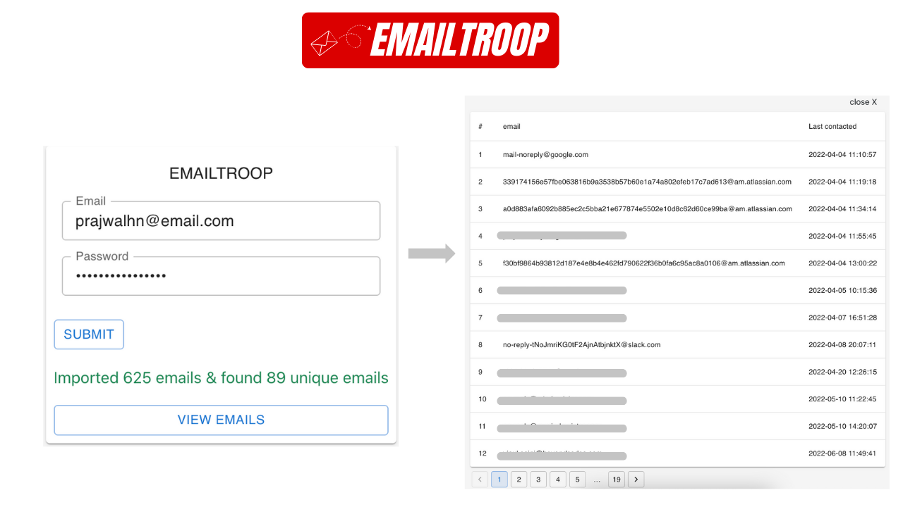

# Emailtroop
Emailtroop is a tool that help you in extracting emails from your inbox.

This tool is under development. You can tinker with it on your machine by cloning the repo.

### Procedures before extracting emails

1. Make sure you have `enabled IMAP` in your GMAIL account.
2. If you have `enabled two factor authentication`, then you need to `create App Passwords` in order to extract emails directly from your inbox. 

